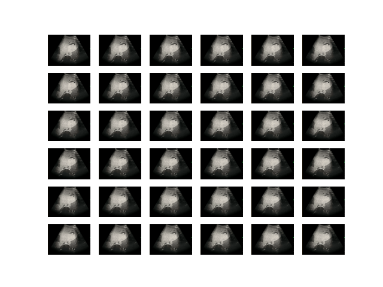
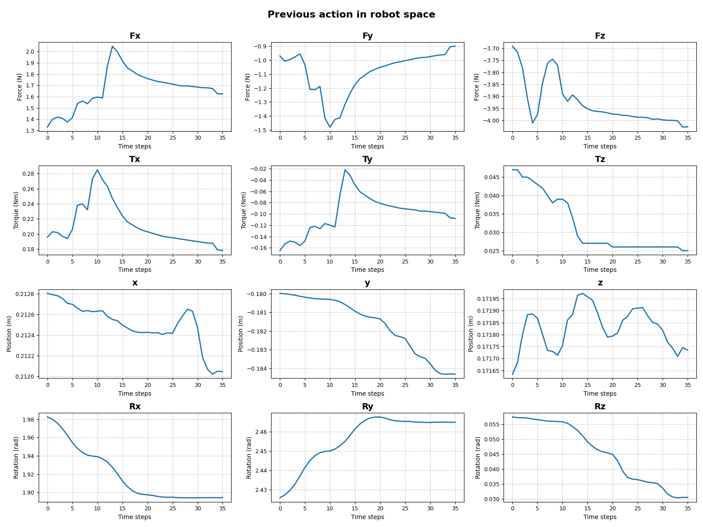
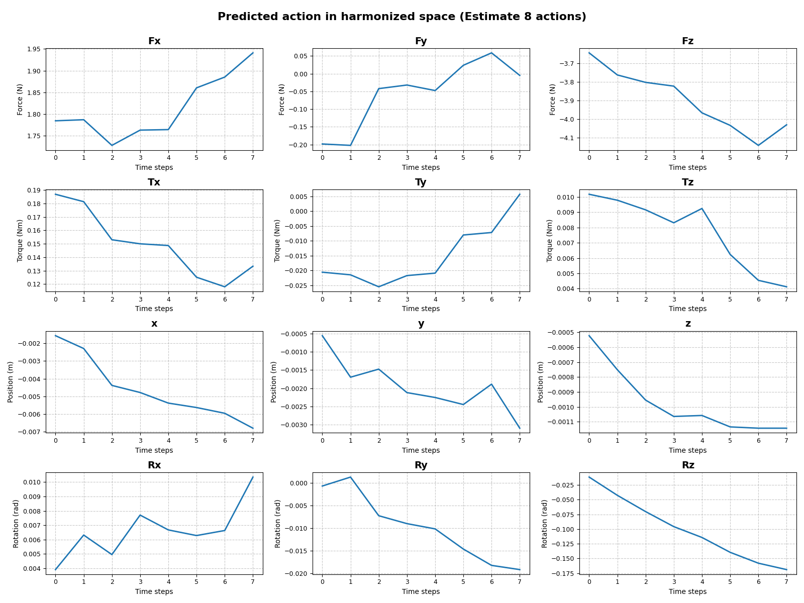
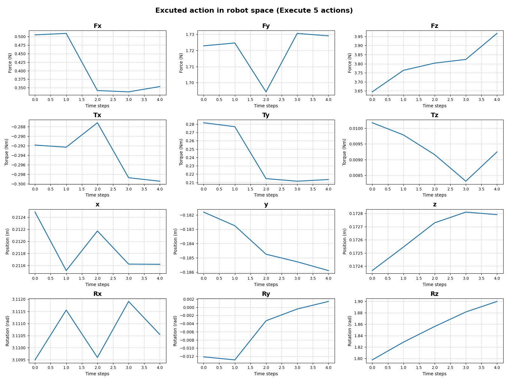

# Autonomous liver ultrasound robot
**Code for "Democratizing expert-level liver sonography through an autonomous lightweight ultrasound robot"**
📋 The complete project details have been submitted through the manuscript review system. Full project documentation and comprehensive codebase will be released following manuscript acceptance.

---
## Demo  
Here we provide a demo that can be run without a physical robot in `CodeForReviewDemo.zip`. The extraction password of the file is the manuscript ID (format with "nBME-xx-xxxx") which could be found from the peer review manuscript.  

The demo includes a detailed readme file with quick setup instructions to help you get started immediately. We also include the readme file in the appendix for better visualization

## Core Components

### 🔥 Multimodal Fusion
- **File**: `diffusion_policy/zhutils/PosiImgFusion.py`
- **Key Method**: `AttnFusionKANForce.forward_Memory()`
- **Description**: Implements attention-based fusion of image, probe pose and force modalities and selects the top-k most important key frames

### 🎯 Pose Harmonization
- **Files**: 
  - `CodeForReview/diffusion_policy/policy/diffusion_zh.py`
  - `CodeForReview/communicate/envonline3cleanHSKE_XYXbot.py`
- **Key Methods**: 
  - `DiffusionUnetHybridImagePolicyForceContinousActionHistory.rel2abs()`
  - `USForceOnlineRead.cal_rel_pose()`
- **Description**: Computes the harmonized poses relative to the pose at the decision time point for generalization across devices and more efficient task understanding

### 🌟 Image Randomization
- **File**: `CodeForReview/DomainRam/DomainRam3Plus.py`
- **Key Class**: `FixedMaskConvexDomainRandomization`
- **Description**: Applies ultrasound-specific domain randomization techniques for generalization across subjects

### 🚀 Action Generation
- **File**: `CodeForReview/diffusion_policy/policy/diffusion_zh.py`
- **Key Method**: `DiffusionUnetHybridImagePolicyForceContinousActionHistory.predict_action_conduct()`
- **Description**: Generates robot actions (6D pose and 6D force) using diffusion model 

---

## Configuration

### Training Configuration
- **File**: `ExampleTrain.yaml`
- **Description**: Reference configuration file containing training hyperparameters and model settings

## Acknowledgments

This work builds upon the following excellent open-source projects:

- **Diffusion Policy**: [https://github.com/real-stanford/diffusion_policy](https://github.com/real-stanford/diffusion_policy) - Foundational framework for diffusion-based policy learning
- **Efficient-KAN**: [https://github.com/Blealtan/efficient-kan](https://github.com/Blealtan/efficient-kan) - Efficient implementation of Kolmogorov-Arnold Networks

We gratefully acknowledge these contributions as the solid foundation for this project.

## Appendix of the demo
## Demo description

This repository provides a demo for “Democratizing expert-level liver sonography through an autonomous lightweight ultrasound robot.” The demo showcases our algorithm, which takes historical images, poses, and forces as input and predicts the poses and forces to be executed. The demo can be run without a physical robot. To protect volunteer privacy, we use an abdominal phantom (Model 057A, CIRS, USA) as an example in this demo.
## Installation

The code was implemented and tested on Ubuntu 20.04.6 LTS. There are two methods to set up the required environment:

### Method 1: Using the Pre-packaged Environment (Recommended)

1. Download the Python environment package:
   ```
   wget https://cloud.tsinghua.edu.cn/f/b5757711d5dd484ea5c8/?dl=1 -O robodiff.zip
   ```

2. Unzip the file and add the environment to Conda:


### Method 2: Manual Installation

1. Install packages listed in the environment file:
   ```
   conda env create -f robodiff_environment.yml
   ```

## Model Checkpoint

Download the model checkpoint:
```
wget https://cloud.tsinghua.edu.cn/f/89b9ca900b134a4c9010/?dl=1 -O checkpoint/model.ckpt
```

Ensure the checkpoint is located at: `checkpoint/model.ckpt`

## Usage

Ensure your terminal's working directory contains `run.py`, then execute:

```bash
conda activate robodiff
python run.py
```

### Input

- `PreviousState.pkl`: Contains states of historical poses, forces, and images

### Output

- `Outputaction/PredAction.npy`: Force and pose estimations in harmonized space
- `Outputaction/ExeAction.npy`: Force and pose conversions in robot space

## Visualization

The `testdemoVis.ipynb` notebook provides visualization of both input and output data.

Input images:
<p align="center">
  
</p>

Input forces and poses in robot space:
<p align="center">
  
</p>

Output forces and poses in harmonized space:
<p align="center">
  
</p>

Output forces and poses in robot space:
<p align="center">
  
</p>
