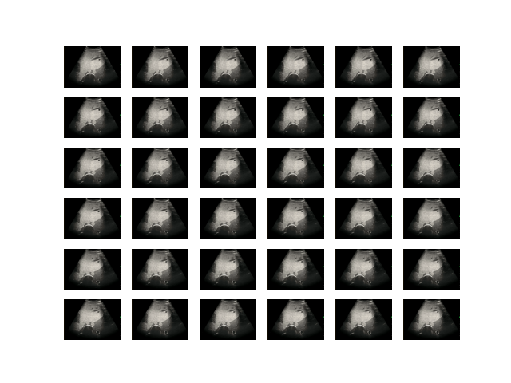
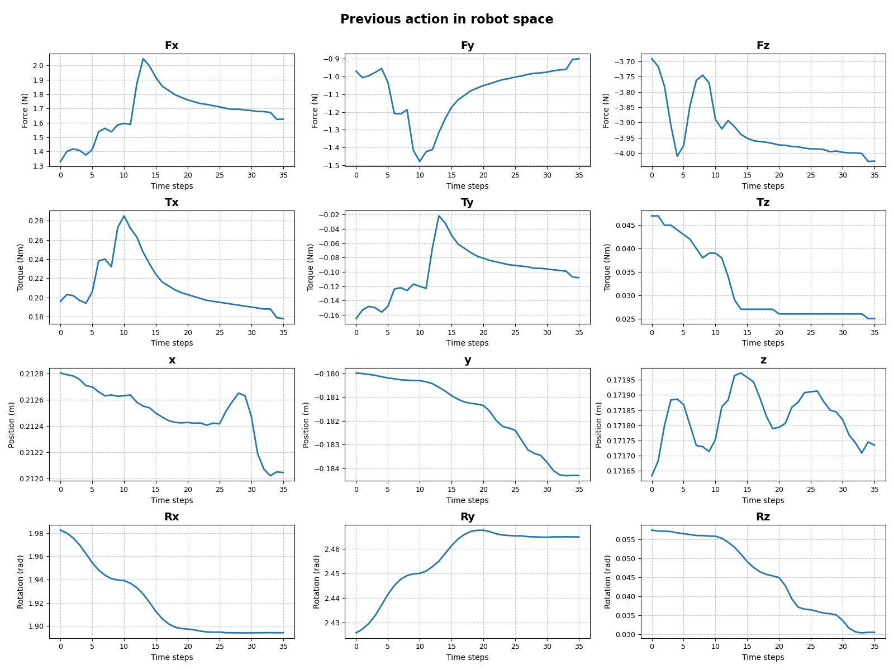
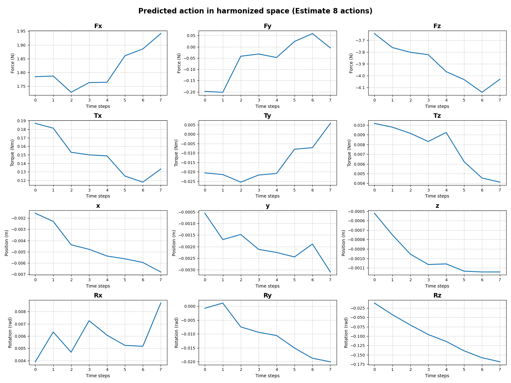
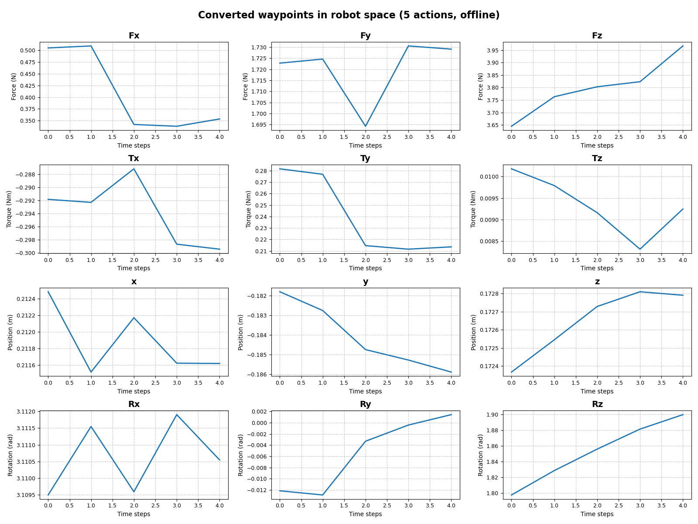

# A lightweight portable ultrasound robot for autonomous liver sonography

This repository provides an offline demonstration of the algorithm described in
“A lightweight portable ultrasound robot for autonomous liver sonography”.
It uses recorded ultrasound images, poses and forces from an abdominal phantom
(Model 057A, CIRS, USA) to predict a chunk of poses and forces. No physical robot
or live acquisition system is required for this demonstration.

The demo source and phantom input are included directly in this repository;
no password-protected archive is required. Training configurations and online
control files are provided as reference material. The workflow below covers
single-step offline inference and visualization, not training or robot deployment.

## Installation

Use Linux with Conda and an NVIDIA GPU compatible with CUDA 11.6. The original
software environment uses Python 3.9 and PyTorch 1.12.1 and was developed on
Ubuntu 20.04.6 LTS. Allow space for the environment archive (about 6.3 GB), its
extracted contents and the checkpoint (about 4.4 GB).

```bash
git clone https://github.com/Lthinker/Expert-level-liver-ultrasoud-robot.git
cd Expert-level-liver-ultrasoud-robot
wget 'https://cloud.tsinghua.edu.cn/f/b5757711d5dd484ea5c8/?dl=1' -O robodiff.zip
mkdir -p .demo-env
unzip robodiff.zip -d .demo-env
conda activate "$PWD/.demo-env/robodiff"
python -m pip install -r requirements-demo.txt
python -c "import sys, torch; print(sys.executable); print(torch.__version__); print(torch.cuda.is_available())"
```

The archive contains a top-level `robodiff/` directory. Confirm that the printed
Python path is inside `.demo-env/robodiff` and CUDA availability is `True`.
Use `python -m ...` to launch Python tools from this extracted environment.
The full original dependency inventory is provided in `robodiff_environment.yml`
for reference; the packaged environment is the supported setup for this demo.

## Model checkpoint

From the repository root:

```bash
mkdir -p checkpoint
wget 'https://cloud.tsinghua.edu.cn/f/89b9ca900b134a4c9010/?dl=1' -O checkpoint/model.ckpt
```

The checkpoint is distributed separately because of its size. Keep its filename
and location as `checkpoint/model.ckpt`.

## Run the demo

With the environment activated:

```bash
python run.py
```

The launcher creates the output directories and runs one offline prediction.
To select another visible GPU, use `python run.py --device cuda:1`.
The first run can take longer while loading the checkpoint and initializing CUDA.

Input: `InputState/PreviousState.pkl`, containing the recorded phantom images,
forces and robot poses. The demo uses the first ten recorded observations.

Outputs are NumPy arrays with columns
`[Fx, Fy, Fz, Mx, My, Mz, x, y, z, r1, r2, r3]`:

| File | Shape | Pose representation |
| --- | --- | --- |
| `Outputaction/PredAction.npy` | `(8, 12)` | Predicted positions in the harmonized frame, with XYZ Euler angles |
| `Outputaction/ExeAction.npy` | `(5, 12)` | First five converted waypoints in robot coordinates, with rotation vectors |

Forces are in N, torques in N m, positions in m, and angles in radians.
`ExeAction.npy` contains calculated commands, not measured robot execution.
Sampling can vary across software or hardware environments.

## Visualization

From the repository root, open `testdemoVis.ipynb` and run its cells in order:

```bash
python -m ipykernel install --sys-prefix --name python3 --display-name robodiff
python -m notebook testdemoVis.ipynb
```

Use the Python kernel from the activated environment. The notebook reads the
input recording and the newly generated output arrays, and saves plots in `figs/`.
It converts robot-space rotation vectors to Euler angles for display; the
predicted harmonized angles are already Euler angles.

For non-interactive execution:

```bash
python -m ipykernel install --sys-prefix --name python3 --display-name robodiff
MPLBACKEND=Agg python -m nbconvert --to notebook --execute testdemoVis.ipynb --output testdemoVis.executed.ipynb --output-dir testoutput --ExecutePreprocessor.timeout=600
```

Input images:



Input forces and poses in robot coordinates:



Predicted forces and poses in the harmonized frame:



Converted waypoints in robot coordinates (offline calculation):



## Core components

- Multimodal fusion: `diffusion_policy/zhutils/PosiImgFusion.py`
- Pose harmonization and action generation: `diffusion_policy/policy/diffusion_zh.py`
- Pose transformations: `robotcontrol.py`
- Offline input and waypoint conversion: `communicate/envoffline.py`
- Ultrasound image randomization: `DomainRam/DomainRam3Plus.py`
- Reference training configuration: `configs/ExampleTrain.yaml`

## Acknowledgments and license

This project builds on [Diffusion Policy](https://github.com/real-stanford/diffusion_policy)
and [Efficient-KAN](https://github.com/Blealtan/efficient-kan).
Original software is distributed under the MIT License; see `LICENSE` and
`THIRD_PARTY_NOTICES.md` for license scope and upstream notices.
